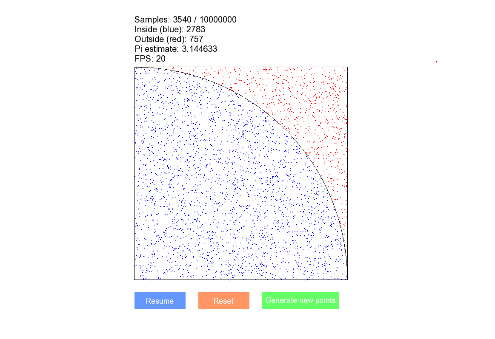

# Monte Carlo Pi Approximation Visualization

**Source Code:** [`MCPiApproximationVisualization.cpp`](../../src/visualizations/MCPiApproximationVisualization.cpp)



## Overview

Real-time visualization of the Monte Carlo method for approximating π. Generates random points in a unit square and determines the ratio that fall within an inscribed quarter circle. Uses SFML for rendering and animates the sampling process at configurable speed.

## Algorithm

### Core Concept

The ratio of a circle's area to its bounding square is π/4. By randomly sampling points in a unit square [0,1] × [0,1] and checking if they fall within the quarter circle (distance from origin ≤ 1), we get:

```
π ≈ 4 × (points inside circle) / (total points)
```

### Implementation Details

**Point Generation**

- Uses `std::mt19937` (Mersenne Twister) for pseudo-random number generation
- Thread-local engine seeded with `std::random_device`
- Uniform distribution over [0,1] using `std::nextafter()` to include upper bound
- Distance calculation via `std::hypot()` for numerical stability

**Data Structure**

```cpp
struct Pt {
    std::array<double, 2> coords;
    bool inside;  // cached result of distance check
};
```

## Architecture

### PiApproximation Class

Encapsulates point generation and classification logic.

**Constructor:** `PiApproximation(int samples)`
- Validates sample count > 0
- Pre-generates all points at initialization

**Key Methods:**
- `generatePoints()`: Batch generates all sample points
- `inside()`: Tests if point lies within unit quarter circle
- `getPoints()`: Returns reference to point vector
- `resetPoints()`: Clears and regenerates new sample set

### Rendering System

**Coordinate Transformation**
- Origin: Bottom-left corner of visualization square
- Basis vectors `Vx`, `Vy` scale unit coordinates to pixel space
- Scaling factor: `rectangleSize / (pointsPerPixel * 100)`

**Animation Control**
- `pointsPerSecond`: Controls visualization speed
- `currentPointIndex`: Tracks rendered point count
- Delta time based updates: `pointsToAdd = elapsed × pointsPerSecond`

**Visual Elements**
- Square: 500×500px bounding box
- Quarter circle: 1001-vertex line strip arc (0 to π/2)
- Points: 1px radius circles, blue (inside) or red (outside)

## Configuration Parameters

| Parameter | Default | Description |
|-----------|---------|-------------|
| `nSamples` | 10,000,000 | Total points to generate |
| `pointsPerPixel` | 100 | Point density scaling factor |
| `rectangleSize` | 500.0f | Visualization area size (pixels) |
| `pointsPerSecond` | 1000.0f | Animation speed |

## Performance Considerations

**Frame Rate Management**
- 30 FPS limit via `setFramerateLimit()`
- FPS calculated over 0.5s rolling window
- Clock restart while paused prevents time accumulation

**Rendering Optimization**
- Single-pass point drawing with statistics accumulation
- Direct vertex array for arc rendering
- Pre-computed coordinate transformation vectors

**Memory**
- All points pre-allocated: ~10M samples × 24 bytes ≈ 240 MB
- Point vector stored by reference to avoid copies

## Controls

### Mouse
- **Pause Button**: Toggle animation
- **Reset Button**: Restart from point 0 (same dataset)
- **Generate New Points**: Create new random sample set

### Keyboard
- `Space`: Toggle pause
- `R`: Reset animation
- `G`: Generate new points
- `Escape`: Exit application

## Dependencies

- **SFML 3.x**: Graphics, window management, event handling
- **C++17**: Standard library features (`std::array`, `std::optional`, etc.)
- **System Font**: `arial.ttf` from `C:\Windows\Fonts\`

## Build Configuration

Compiler flags required:
```
-std=c++17 -O2
-lsfml-graphics -lsfml-window -lsfml-system
```

## Statistical Output

Real-time display includes:
- Sample count (current / total)
- Inside count (blue points)
- Outside count (red points)
- Current π estimate
- Rendering FPS

Convergence rate follows √n behavior typical of Monte Carlo methods.
